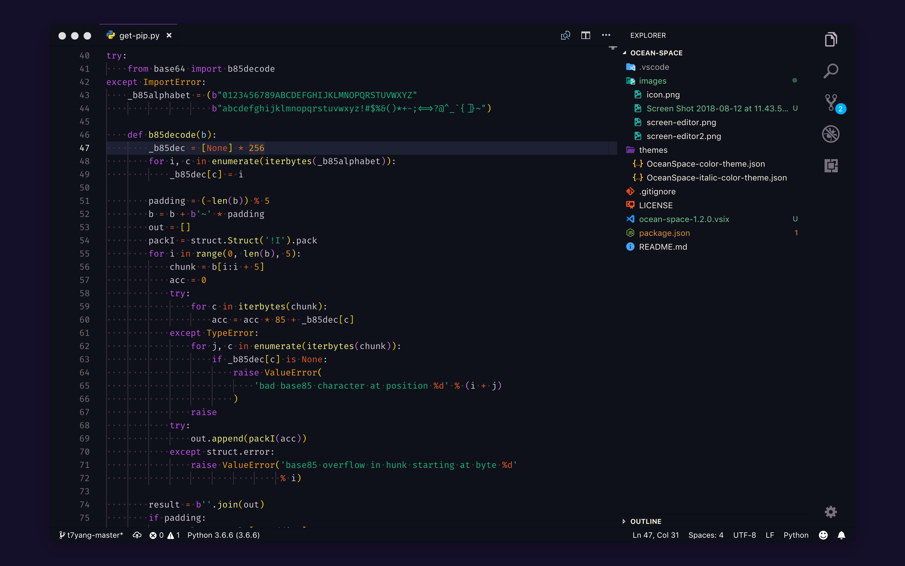

<h1 align="center">

</h1>

<h4 align="center">
 🌊 Deep oceanic blue Visual Studio Code theme
</h4>

> **NOTE**: This theme includes a variant with italic keywords that looks great with fonts like Operator Mono or Catograph Mono

## Special thanks

Thanks to [Klaus Sinani](https://github.com/klauscfhq) for his [hyperocean](https://github.com/klauscfhq/hyperocean) theme, which highly inspired this VS Code port.

## License

[MIT](https://github.com/oscarmcm/ocean-space/blob/master/LICENSE)
